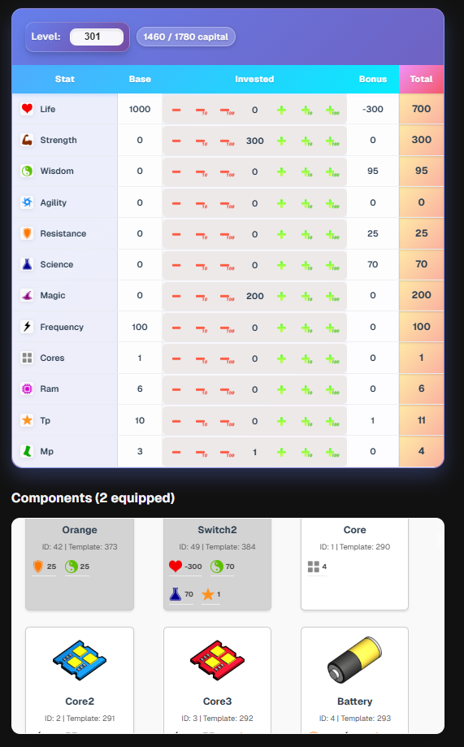

# LeekWars Restator (revisited)

[WEBSITE](https://leek-wars-restator.vercel.app/)

This project was inspired from the original [restator](http://leekwars.restator.free.fr/) project

It is a tool to theorycraft builds & player stats for the coding game [LeekWars](https://leekwars.com/)

The original project was outdated (LeekWars now has chips, RAM, Cores etc) so I decided to make my own

It is still a work in progress

# Roadmap

- Implement stats system ✅
- Add weapon & chips ✅
- Add components ✅

- Calculate weapon & chips effects relative to total stats
  - Heal ✅
  - Raw Damage ✅
  - Poisons ✅
  - Nova 🟧
  - Boosts🟧
- Calculate max weapon & chip effect (cast x 3, based on total APs) ✅
- Calculate multiple turn effects sum value (poisons etc)
- Handle available components slot count (with level + components that removes X slots?)

- Export leek for leek-wars-generator json entity scenario ✅

## Discord

Join the **Leek Wars Tools** [Discord](https://discord.gg/Py6EaDhQE5)
